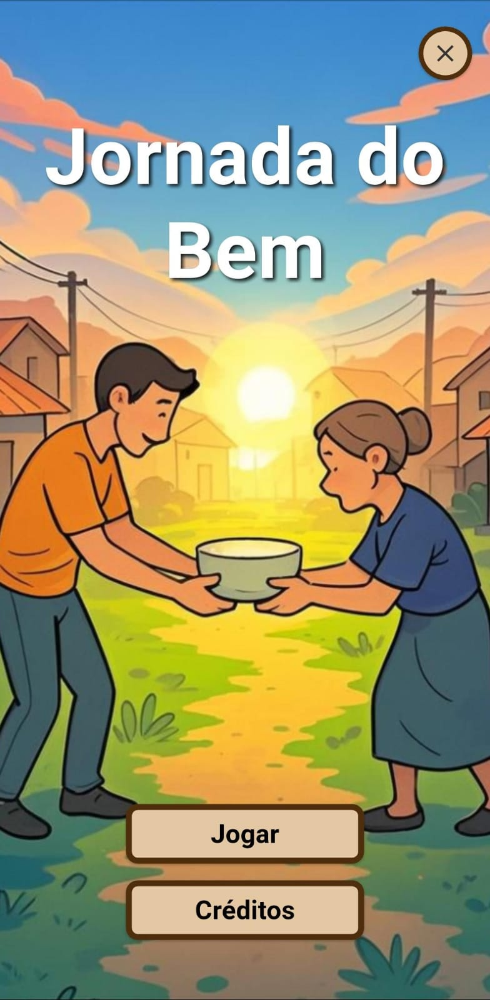

# 🎮 Missão Solidária

**Missão Solidária** é um jogo educacional desenvolvido em Flutter, com o objetivo de promover valores como solidariedade, empatia e responsabilidade social por meio de experiências interativas e lúdicas. O projeto foi idealizado como parte das atividades acadêmicas do curso de Ciência da Computação da UNISAGRADO.

## 📚 Contexto

O jogo foi desenvolvido como trabalho prático para aplicação de conceitos de desenvolvimento mobile com Flutter, organização de interfaces por telas e lógica de jogo com múltiplos estados, fases e interações com o usuário.

## 🧩 Visão Geral

O jogador é conduzido por uma narrativa interativa com diferentes desafios e minijogos, representando ações solidárias do cotidiano. O objetivo principal é concluir as missões com sucesso, escolhendo corretamente os itens e evitando erros.

### Minijogos Disponíveis

- **Coleta de Alimentos**: Identifique e selecione os alimentos apropriados para doação.
- **Separação de Roupas**: Selecione as roupas em mal estado, impedindo que elas sejam destinadas à doação.
- **Coleta de Lixo**: Recolha corretamente os resíduos conforme solicitado, contribuindo para a preservação e limpeza do ambiente.

O destaque vai para o **minijogo de roupas**, que apresenta **3 fases com dificuldade progressiva**, variando conjuntos de roupas, limites de erro e velocidade dos objetos em tela.

## ⚙️ Tecnologias Utilizadas

- **Flutter** e **Dart**
- Gerenciamento de estado com `setState`
- Organização modular por telas e componentes
- Utilização de recursos gráficos (sprites, imagens e sons locais)

## 💡 Funcionalidades

- Múltiplos minijogos com regras específicas
- Sistema de pontuação e feedback por desempenho
- Modos de dificuldade com ajustes de layout e velocidade
- Interface intuitiva e acessível
- Progresso sequencial entre as fases

## 🖼️ Imagens

Tela Inicial

  

Minijogo de Roupas

  

## 👤 Autor

Desenvolvido por **Heitor Lupino**  
Estudante de Ciência da Computação na [UNISAGRADO](https://unisagrado.edu.br)

🔗 [LinkedIn](https://www.linkedin.com/in/heitor-lupino-b580562b5)  
📧 heitorlupino@gmail.com
